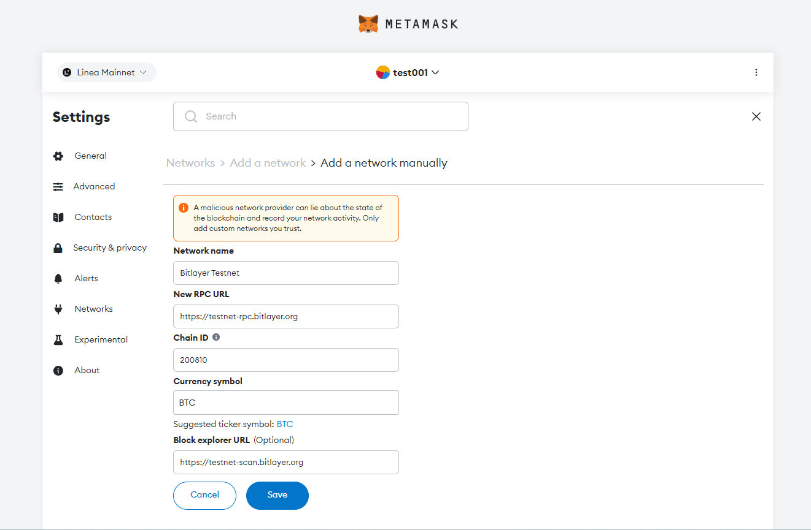
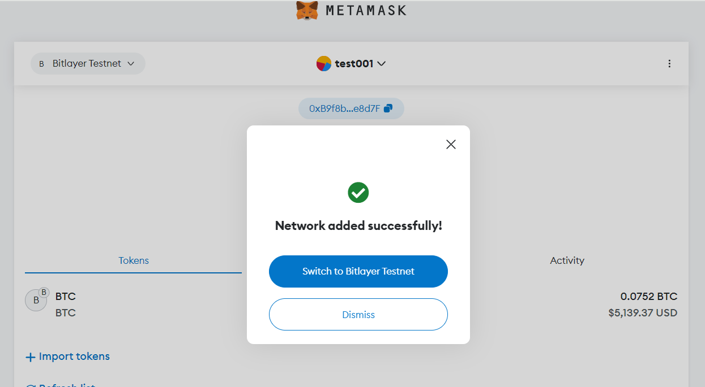

## How to Connect a Wallet to Bitlayer Testnet
Here is the suggested workflow to explore the Bitlayer Testnet:
1. Create a MetaMask wallet. Other types of wallets, including Particle, Unisat, Xverse, are also accepted.
2. Add the Bitlayer Testnet configurations to your wallet
3. Using a Bitcoin Faucet to power your first transactions
4. Request test tokens in the Bitlayer Testnet to power your first transactions

### Setup: MetaMask Wallet 
Wallets can connect to various blockchains, with MetaMask, Unisat, Xverse, etc. can connect to Bitlayer. Metamask is a great wallet that you can use. This article is a guide that assumes you have a Metamask wallet. 
If you need to help doing this, here is an official guide to set up a MetaMask wallet account below: Getting started with MetaMask.

### Add the Bitlayer Testnet configurations to your wallet
Once you have a MetaMask wallet, you can start using the Bitlayer testnet and explore new DApps, interacting with contracts like Satswap. 
The first thing you need to do is add the Bitlayer network testnet to your wallet. 

### You can add Bitlayer Testnet in one click below.
Add Testnet

### You can also add the Bitlayer Testnet manually.
Once Metamask is open, click the Ethereum Mainnet button and click the Add network button to set up the Bitlayer testnet.

At the bottom of the existing list, click “Add more networks manually”.

Fill out the network information as follows. Once the data is entered correctly, please click the "save" button.

You can copy/paste the following configuration details into the corresponding field in your wallet.

| Key | Value |
|---|---|
| 网络 | Bitlayer Testnet |
| RPC URL | [https://testnet-rpc.bitlayer.org](https://testnet-rpc.bitlayer.org) |
| Chain ID | 200810 |
| urrency symbol | BTC |

After saving the network configuration, you should now have the Bitlayer Testnet selected!

### Faucet: Request testnet tokens on Bitlayer Testnet to power your first transactions
Bitlayer is an EVM-compatible blockchain, and can enable applications and developers from the existing Ethereum ecosystem to migrate to Bitlayer at low cost, eliminating the need for substantial modifications or rewrites.

If you want to interact with the Dapps on Bitlayer Testnet, your first stop is going to be to a “faucet” to fill up your “tank”. 

Here is a faucet directly distributes Bitlayer Testnet tokens: https://www.bitlayer.org/faucet

It may take a few seconds for them to appear, but you can check the status by looking for a transaction for your address in [Bitlayer Explorer](https://testnet-scan.bitlayer.org).

**Pace Yourself!**

**You can obtain Bitlayer Testnet tokens every 24 hours for development.**

**And the testnet token has no financial value and cannot be traded at a real price.**

### Transfer Tokens
You can use your wallet’s normal function for transferring tokens within the Bitlayer Testnet — no additional configurations are needed. The following are the conventional steps:

**Step 1**: Open your wallet and switch to Bitlayer Testnet

**Step 2**: Click the Send button in the middle and type the address you want to transfer to in the text box.

**Step 3**: Select the token in the Asset box and type the amount of token that you want to transfer.

**Step 4**: Click the Next button and then click the Confirm button to send out the transaction.

**Step 5**: After sending, you can find the transaction in the Activity tab in your wallet.

